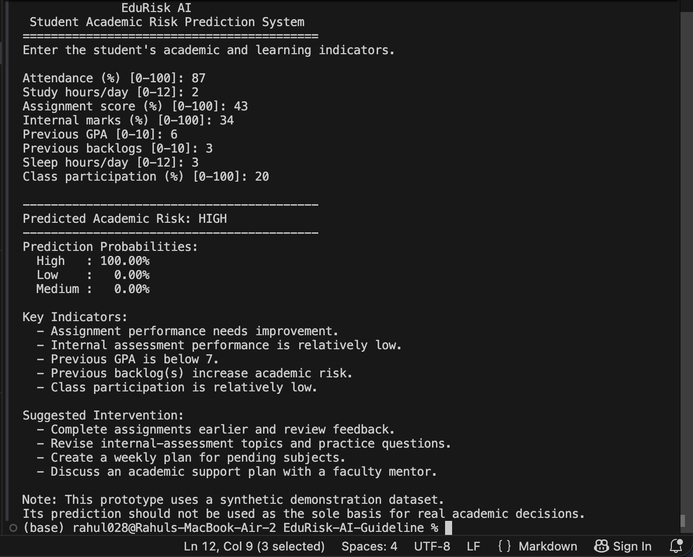
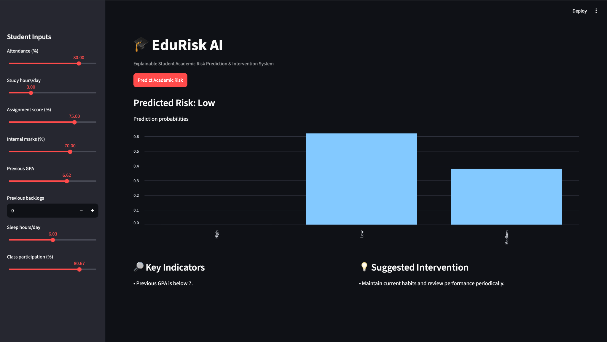
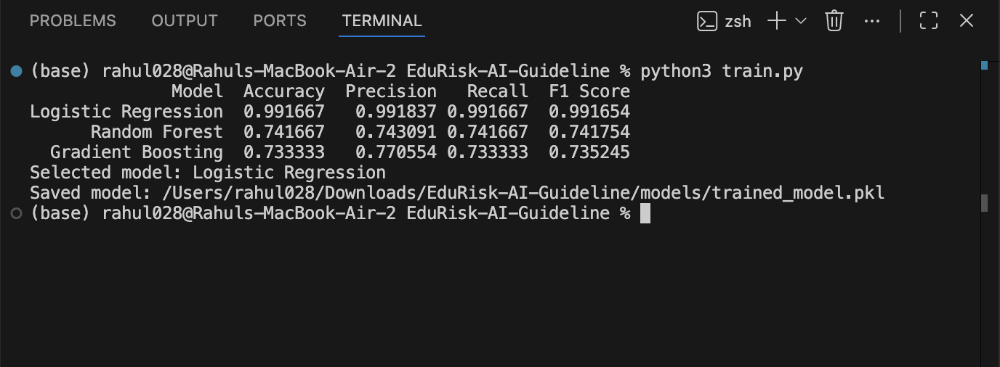

EduRisk AI

EduRisk AI is a machine learning prototype that classifies a student's academic risk as Low, Medium, or High using different learning and performance indicators.

1. Overview

EduRisk AI demonstrates the complete machine learning workflow for academic risk prediction. The system takes selected student indicators as input, performs the required preprocessing, applies a trained classification model, and displays the predicted risk level.

The main version of the project can be used through the command line. An optional Streamlit dashboard is also included to demonstrate the same prediction process through a graphical interface.

The dataset used in this project is synthetic and is intended only for demonstration and learning purposes. Therefore, the model results should not be considered representative of real-world or production performance.

2. Objectives

The main objectives of this project are:

To build a complete supervised classification pipeline
To validate and preprocess student performance data
To train and compare multiple classification models
To select and save the best-performing model
To predict the academic risk level of an individual student
To display the probability distribution of the prediction
To identify rule-based risk indicators
To provide rule-based academic intervention suggestions
To keep the project modular and easy to test
3. Functional Modules
Module	Purpose
Data Loading and Validation	Loads the CSV dataset and checks the required columns and risk labels
Preprocessing	Handles missing values and standardizes the numerical features
Model Training and Comparison	Trains three classification models and compares their evaluation results
Risk Prediction	Takes student information and predicts the academic risk level
Interpretation and Intervention	Identifies rule-based indicators and provides academic intervention suggestions
User Interface	Provides a command-line interface and an optional Streamlit dashboard
4. Input / Output
Input

To predict the risk level of an individual student, the following values are entered:

Metric	Min	Max
Attendance %	0	100
Study hours per day	0	12
Assignment score %	0	100
Internal marks %	0	100
Previous GPA	0	10
Previous backlogs	0	10
Sleep hours per day	0	12
Class participation %	0	100
Output

The system provides:

Predicted academic risk (Low, Medium, or High)
Probability distribution for the risk classes
Rule-based indicators related to the prediction
Suggested academic interventions
5. Machine Learning

The target variable used for prediction is risk_level.

The dataset is divided into training and testing sets using an 80/20 stratified split. Three classification algorithms are trained and compared:

Logistic Regression
Random Forest
Gradient Boosting

The models are compared using:

Accuracy
Precision
Recall
F1 Score

The model with the highest weighted F1 score is selected as the final model.

Before training, missing values are handled using median imputation and the numerical features are standardized.

The selected model is saved as:

models/trained_model.pkl

For the current synthetic dataset, Logistic Regression is selected based on the highest weighted F1 score. These results are only illustrative because the dataset is synthetic.

6. Project Structure
EduRisk-AI/
├── app.py
├── predict_cli.py
├── train.py
├── requirements.txt
├── README.md
├── statement.md
├── .gitignore
│
├── data/
│   └── student_performance.csv
│
├── models/
│   ├── trained_model.pkl
│   └── model_results.csv
│
├── src/
│   ├── __init__.py
│   ├── config.py
│   ├── data_loader.py
│   ├── data_validation.py
│   ├── preprocessing.py
│   ├── model_training.py
│   ├── model_comparison.py
│   ├── evaluation.py
│   ├── predictor.py
│   ├── explainability.py
│   └── intervention.py
│
├── tests/
│   ├── test_data.py
│   ├── test_model.py
│   └── test_prediction.py
│
├── docs/
│   ├── architecture.md
│   ├── workflow.md
│   ├── diagrams.md
│   ├── requirements.md
│   └── dataset_and_evaluation.md
│
├── report/
│   └── EduRisk_AI_Project_Report.pdf
│
└── screenshots/
    ├── cli_prediction.png
    ├── model_training.png
    └── streamlit_dashboard.png
7. Setup

The project requires Python 3.10 or higher.

Install the required dependencies using:

pip3 install -r requirements.txt
8. Training

To train the models and compare their performance using the sample dataset, run:

python3 train.py

After training, the following files are generated:

models/trained_model.pkl - the selected trained model
models/model_results.csv - the model evaluation results
9. Terminal Interface

The main functionality can be demonstrated directly from the terminal:

python3 predict_cli.py

The program asks for the required student information and then displays:

Predicted risk level
Probability distribution
Rule-based indicators
Suggested academic interventions

This provides a simple way to demonstrate the input and output flow of the system.

10. Streamlit Dashboard (Optional)

An optional graphical interface is included using Streamlit.

To start the dashboard, run:

streamlit run app.py

The dashboard provides input controls for the student indicators and displays the prediction, probability distribution, key indicators, and suggested interventions.

The command-line interface remains available as the main way to demonstrate the project functionality.

11. Testing

The project includes validation and test cases to check the main parts of the system.

Run the tests using:

python3 -m pytest -q

The tests check that:

The dataset is loaded and validated correctly
The trained model is available
The prediction output has the expected structure
12. Non-Functional Requirements
Requirement	Implementation
Usability	The terminal provides clear prompts and organized output
Reliability	Input ranges, risk labels, and required dataset columns are validated
Maintainability	Different parts of the project are separated into dedicated modules
Performance	Lightweight machine learning models allow quick prediction for an individual student
Error Handling	Descriptive messages are provided for invalid input and missing files
Resource Efficiency	The project uses a relatively small dataset and lightweight models and can run locally
13. Documentation

The supporting project documentation is available in the docs/ folder.

It includes:

System architecture
Prediction workflow
Use Case Diagram
Component Diagram
Sequence Diagram
Functional and non-functional requirements
Dataset description
Model selection and evaluation details
14. Limitations

The project uses a synthetic dataset, so it is intended only as an academic prototype and is not suitable for production use.

The rule-based explanation layer identifies input conditions that are associated with certain risk indicators. It does not explain the internal decision-making process of the machine learning classifier.

The system should therefore be treated as a learning project and not as a replacement for human judgment in real academic decisions.

15. Future Improvements

Some possible improvements for future versions are:

Use a suitable real and anonymized dataset
Apply cross-validation for more robust model evaluation
Add additional evaluation metrics and visualizations
Add model monitoring and retraining procedures
Use model-specific explanation methods such as SHAP
Add authentication and authorization
Provide more personalized interventions based on student progress
16. Technology Stack
Python
Pandas
NumPy
Scikit-learn
Joblib
Streamlit
Pytest
Git
17. Academic Note

This project was developed as part of coursework for an AI/ML module.

The main focus of the project is to demonstrate the supervised machine learning workflow, starting from data validation and preprocessing and continuing through model training, model comparison, prediction, evaluation, and interpretation.

A synthetic dataset is used so that the complete workflow can be demonstrated without making claims about the model's production-level performance.
## Screenshots

### CLI Prediction

### Streamlit Dashboard

### Model Training and Evaluation
