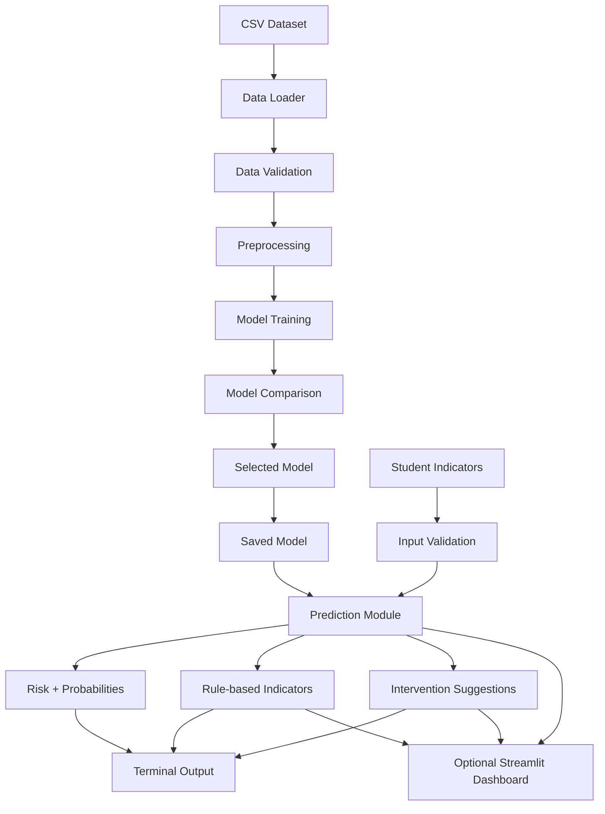

# System Architecture

EduRisk AI is divided into a training pipeline and a prediction layer.

## Main Components

- **Data Loader:** reads the CSV file.
- **Data Validation:** checks required fields and supported labels.
- **Preprocessing:** imputes missing numeric values and standardizes features.
- **Model Training:** creates the three supervised classifiers.
- **Model Comparison:** calculates Accuracy, Precision, Recall, and weighted F1 Score.
- **Predictor:** loads the selected model and predicts a new student's risk.
- **Explainability Layer:** applies predefined threshold rules to identify indicators for attention.
- **Intervention Layer:** converts identified indicators and risk level into suggestions.
- **Interfaces:** terminal CLI for direct output and optional Streamlit dashboard for visualization.
