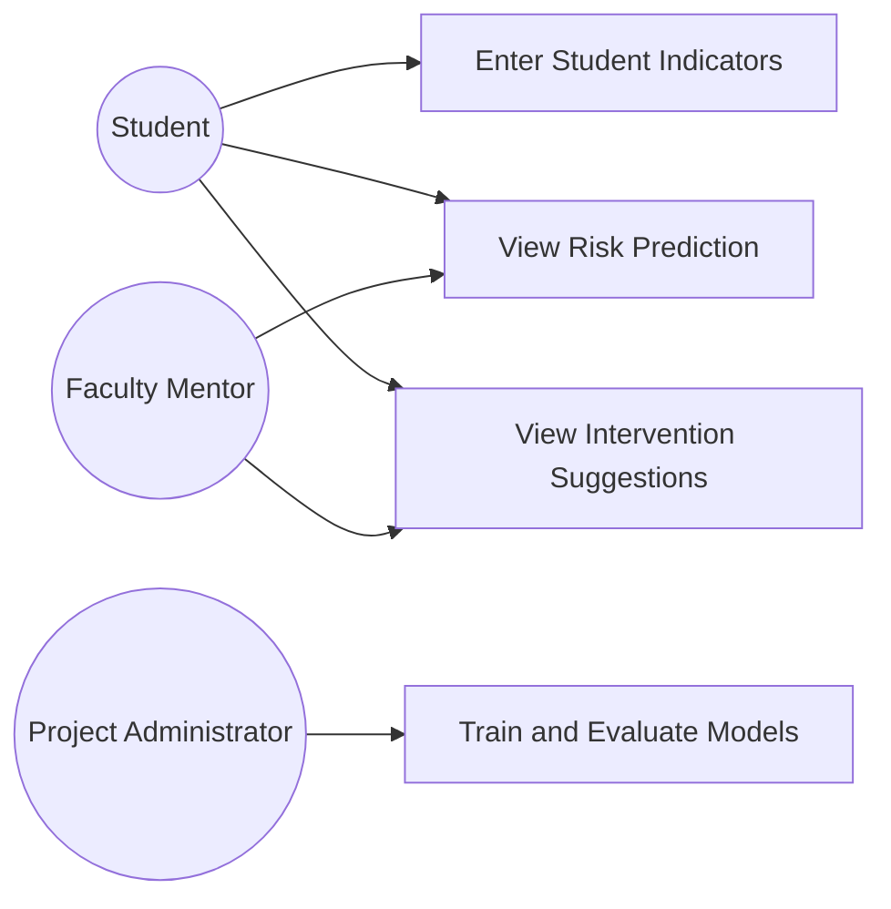
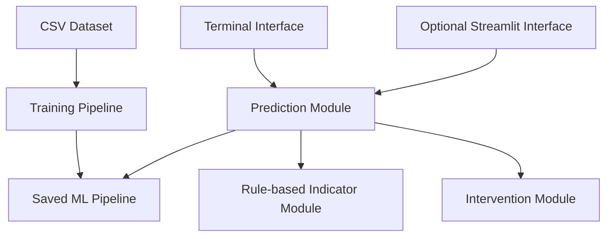
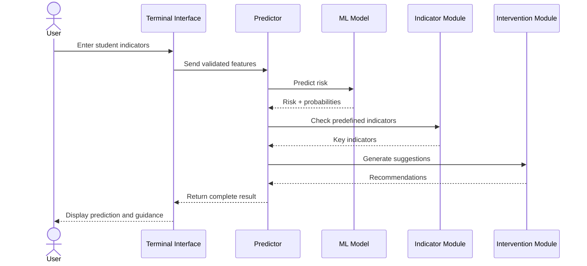

# UML / Design Diagrams

## Use Case Diagram

## Component Diagram

## Sequence Diagram

## Storage Design

The prototype uses a CSV file for the demonstration dataset and a local serialized model file for the trained pipeline. A relational database is not required for the current scope, so an ER diagram is not applicable.
