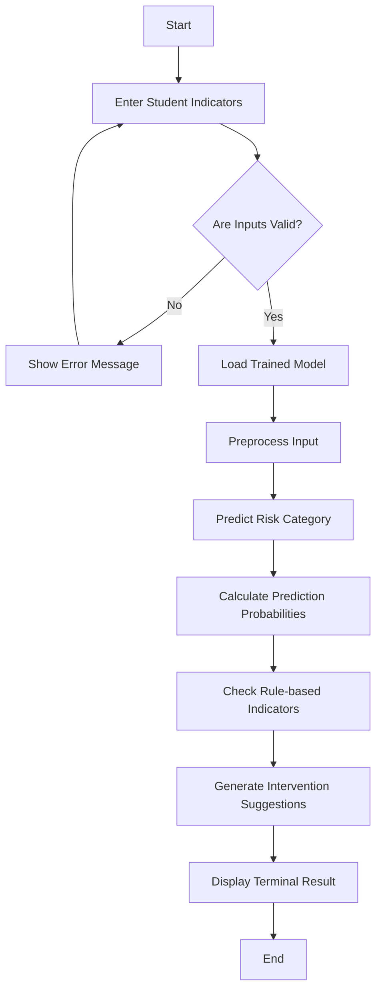

# Process Workflow



## Training Workflow

```text
CSV dataset
   ↓
Validation
   ↓
80:20 stratified split
   ↓
Preprocessing
   ↓
Logistic Regression + Random Forest + Gradient Boosting
   ↓
Metric comparison
   ↓
Select highest weighted F1 Score
   ↓
Save trained pipeline
```
